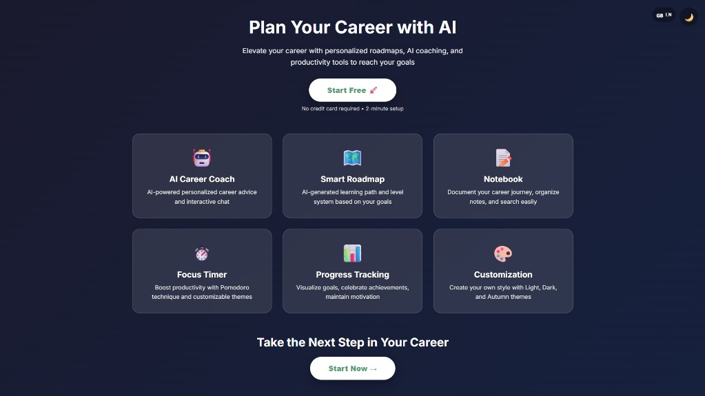
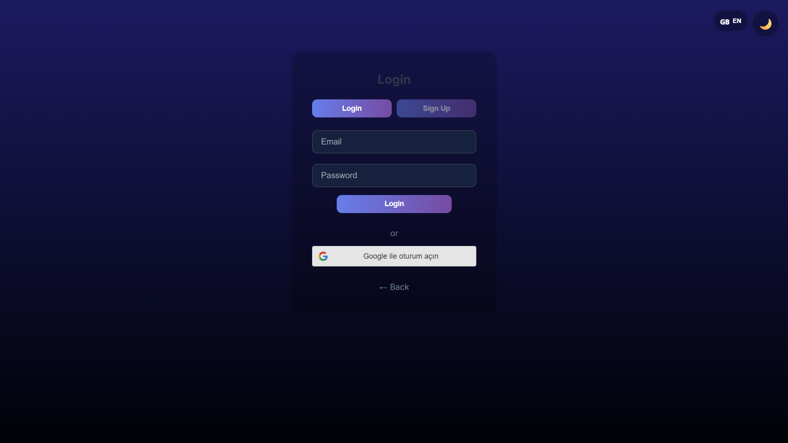
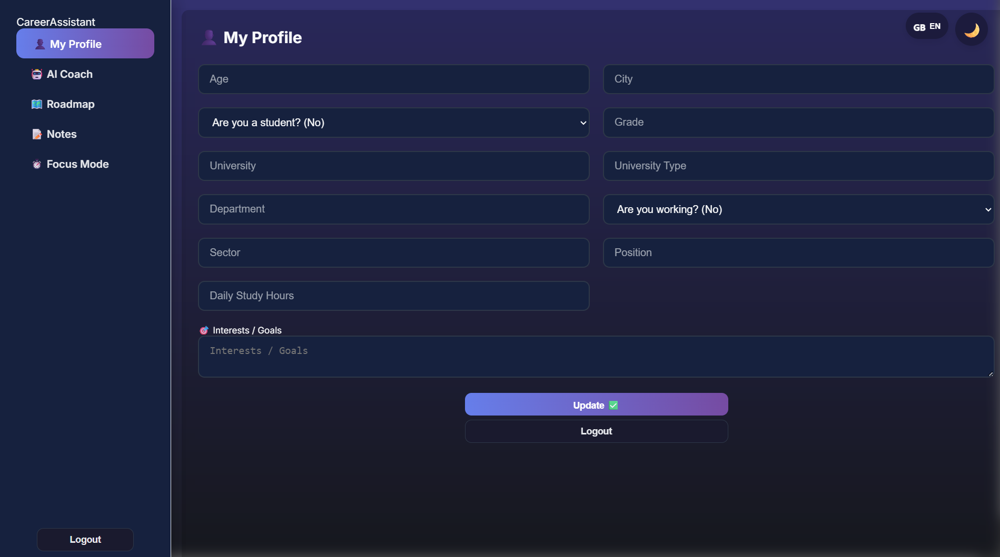
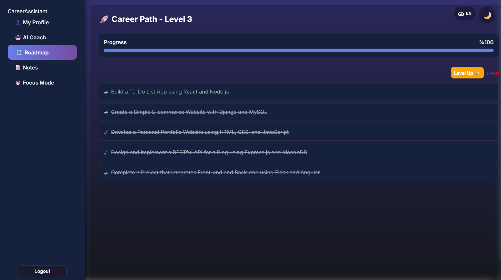

# GuidyMate


AI-powered career planning assistant built as a personal full-stack project.

> A web application that helps users manage their career journey with personalized roadmaps and productivity tools.

---

## Preview

<div align="center">

### Landing & Authentication
 

### Dashboard
 

### [🌐 Live Demo - Try it yourself!](https://guidymate.com.tr)

</div>

---

## Key Features

- AI Career Coach - Personalized guidance using Groq API
- Smart Roadmap - Level-based progression system
- Focus Timer - Pomodoro technique with custom themes
- Notes System - Organize your learning
- Multi-Language - Turkish and English support
- Google OAuth - Secure authentication

---

## Tech Stack

**Frontend:**
- React 18 + Vite
- CSS Modules
- Context API
- Google OAuth 2.0

**Backend:**
- Node.js + Express.js
- PostgreSQL
- JWT Authentication
- Bcrypt

**AI:**
- Groq SDK (Llama-3 Model)

**Tools:**
- Git
- Docker
- Render/Vercel

---

## Getting Started

```bash
# 1. Clone the repository
git clone https://github.com/EdaNurBinici/guidymate-app.git
cd guidymate-app

# 2. Backend Setup
cd web-app-api
npm install
# Create .env file with your database credentials
npm start

# 3. Frontend Setup (New Terminal)
cd frontend
npm install
npm run dev
```

For detailed setup instructions, see [SETUP.md](./docs/SETUP.md)

---

## Architecture

Built with MVC-inspired structure:

- **Frontend:** React components with dedicated modules for each feature
- **Backend:** RESTful API with Express.js
- **Database:** PostgreSQL with relational design
- **AI Integration:** Groq SDK for career guidance

---

## Documentation

- [Setup Guide](./docs/SETUP.md)
- [Deployment Guide](./docs/DEPLOYMENT.md)
- [Contributing](./CONTRIBUTING.md)

---

## License

This project is licensed under the MIT License - see the [LICENSE](./LICENSE) file for details.

---

## Developer

**Eda Nur Binici**

[](https://www.linkedin.com/in/eda-nur-binici)
[](https://github.com/EdaNurBinici)

---

⭐ If you find this project helpful, feel free to give it a star!
